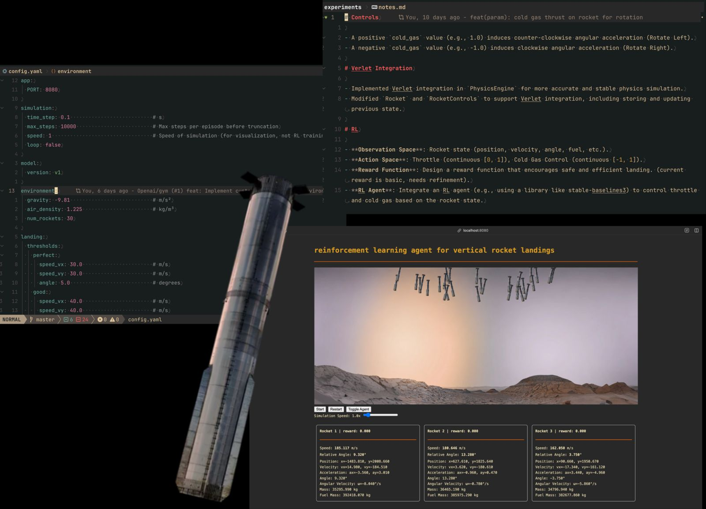
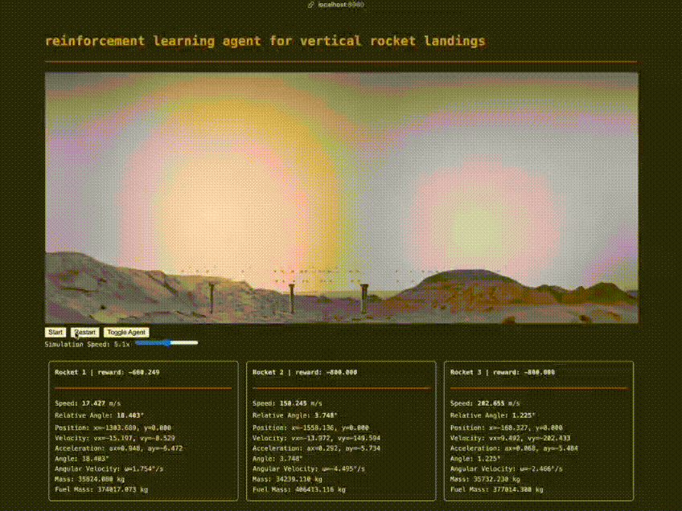

i wanted to build a full reinforcement learning system that could learn to land a vertically falling rocket booster safely back on the ground, mimicking the spacex falcon 9 landing. the booster starts in mid-air with an initial altitude, velocity, and orientation, and it must land softly, upright, and centered on a target zone (landing pad is not taken into the account as of now though).

the system must simulate realistic physics (gravity, thrust, rotation, momentum), allow my model to control the booster through throttle and cold gas actions, and provide a reward signal that encourages safe and efficient landings. i want to visualize the simulation live as the model learns and interactively observe how the rocket behaves during training. i also want to be able to inspect the training process, pause it, resume it, and understand what the model is learning over time.



```
make start
```

you can change the number of rockets from the [`config.yaml`](https://github.com/adimail/rocket-landing-rl/blob/master/config.yaml) file. press the toggle button to enable/disable the agent controls. when you disable the agent, you can control the rocket using W-A-D keys.

---

**rocket state variables:**

- **`x` (position x):**
  - unit: meters (m)
  - initial range: `[-1500.0, 1500.0]`
  - simulation range: potentially unlimited (can go beyond initial bounds).
  - observation range (clipped): `[-1500.0, 1500.0]`
- **`y` (position y / altitude):**
  - unit: meters (m)
  - initial range: `[1800.0, 2200.0]`
  - simulation range: `[0, infinity)` (can go higher or hit ground).
  - observation range (clipped): `[0.0, 1500.0]` (note: max uses `position_limits.x` max from config)
- **`vx` (velocity x):**
  - unit: meters per second (m/s)
  - initial range: `[-25.0, 25.0]`
  - simulation range: potentially unlimited.
  - observation range (clipped): `[-25.0, 25.0]`
- **`vy` (velocity y):**
  - unit: meters per second (m/s)
  - initial range: `[-200.0, -150.0]`
  - simulation range: potentially unlimited (negative is downwards).
  - observation range (clipped): `[-200.0, 200.0]` (note: min uses negative of `velocity_limits.vy` max from config)
- **`ax` (acceleration x):**
  - unit: meters per second squared (m/s²)
  - initial range: `[-5.0, 5.0]`
  - simulation range: determined by forces (thrust, drag, gravity) and mass; not strictly limited but physically constrained.
- **`ay` (acceleration y):**
  - unit: meters per second squared (m/s²)
  - initial range: `[-5.0, 5.0]`
  - simulation range: determined by forces (thrust, drag, gravity) and mass; includes gravity component.
- **`angle`:**
  - unit: degrees (deg)
  - initial range: `[-15.0, 15.0]`
  - simulation range: normalized to `[-180, 180)`.
  - observation range (clipped): `[-15.0, 15.0]`
- **`angularvelocity`:**
  - unit: degrees per second (deg/s)
  - initial range: `[-10.0, 10.0]`
  - simulation range: potentially unlimited, but influenced by damping.
  - observation range (clipped): `[-10.0, 10.0]`
- **`angularacceleration`:**
  - unit: degrees per second squared (deg/s²)
  - initial range: calculated based on initial state (often 0 if no initial cold gas).
  - simulation range: determined by cold gas control, mass, radius; not strictly limited but physically constrained.
- **`mass` (dry mass):**
  - unit: kilograms (kg)
  - initial range: `[34000, 38000]`
  - simulation range: constant throughout simulation.
- **`fuelmass`:**
  - unit: kilograms (kg)
  - initial range: `[370000, 410000]`
  - simulation range: decreases from initial value towards `0.0` based on throttle usage.
- **`totalmass`:** (derived)
  - unit: kilograms (kg)
  - simulation range: `mass + fuelmass`, decreases as fuel is consumed.
- **`speed`:** (derived)
  - unit: meters per second (m/s)
  - simulation range: `sqrt(vx^2 + vy^2)`, non-negative.
- **`relativeangle`:** (derived)
  - unit: degrees (deg)
  - simulation range: `abs(angle)`, non-negative.

**actions & effects:**

- **`throttle` `(action[0])`:**
  - range: `[0.0, 1.0]` (normalized)
  - effect:
    - scales the main engine `thrust_power`.
    - applies thrust force along the rocket's current `angle` (positive `y` component when upright).
    - consumes `fuelmass` proportional to the throttle value.
- **`coldgas` `(action[1])`:**
  - range: `[-1.0, 1.0]` (normalized torque request)
  - effect:
    - scales the `cold_gas_thrust_power` to generate torque.
    - positive value (`> 0`): induces counter-clockwise angular acceleration (rotate left).
    - negative value (`< 0`): induces clockwise angular acceleration (rotate right).
    - zero value (`0`): no angular acceleration from cold gas thrusters.


