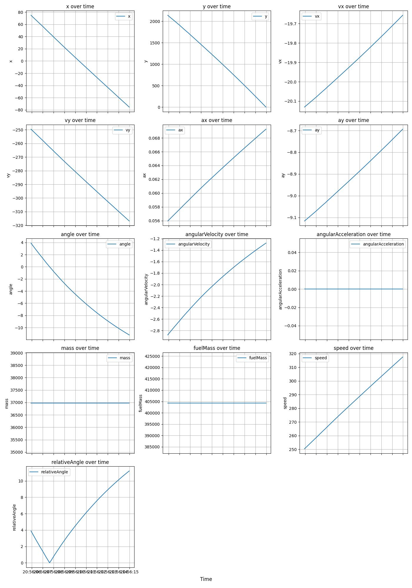

# Environment

What are you trying to solve? (cartpole, lunar lander, some other custom environment). If you're trying to make some Al play a game, the game is the environment.

# Model

The algorithm (PPO, SAC, TRPO, TD3, etc)

# Agent

The entity that interacts with the environment using an algorithm/model (The rocket).

# Observation (or "state")

Important details of the environment that are fed to the model to make action predictions.

# Action

What the agent does in the environment. "{throttle 1, cold_gas: -0.8}" could be an example of an action.

# Step

Progress in the environment. Can be thought of like FPS, where each "frame" is a step. In general a "step" in the environment will take an action for the agent to do, and return a new observation and reward for the step.

| Discrete              | Continuous                         |
| --------------------- | ---------------------------------- |
| clear classifications | like regression                    |
| Go left or go right   | Go 0.02 right, or 0.5 or 0.344221. |
|                       | a range                            |
|                       | common in robotics (servos)        |

# Simulation logs

## _free fall rocket_

